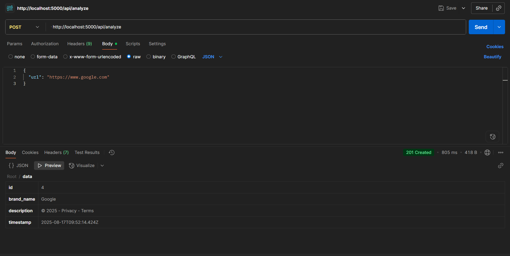
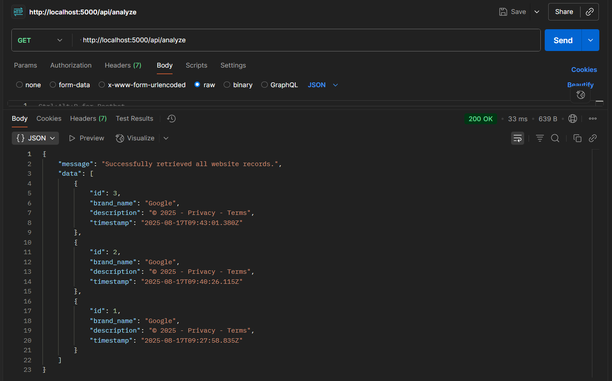
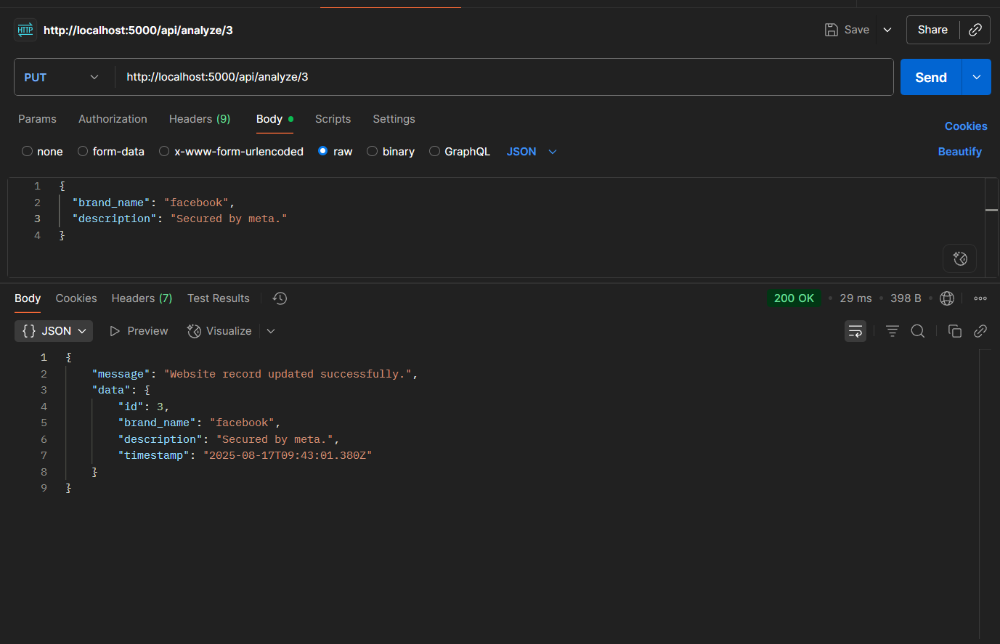
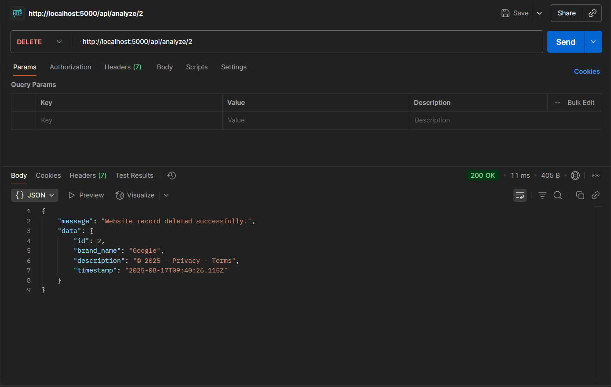

Here’s a properly formatted **README.md** version of your internship assignment. You can copy–paste it directly:

````markdown
# Backend Development Internship Assignment

This repository contains the solution for the **Backend Development Intern Assignment**.  
The project is a **Node.js API** that analyzes website URLs, extracts key information, and provides full **CRUD (Create, Read, Update, Delete)** operations for the stored data using a **PostgreSQL database**.

---

## 🚀 Tech Stack
- **Backend Framework**: Node.js (Express.js)  
- **Database**: PostgreSQL  
- **Web Scraping**: Axios, Cheerio  
- **AI Integration (Bonus)**: Google Gemini API (`gemini-2.5-flash-preview-05-20`) for description enhancement  
- **Environment Variables**: dotenv  
- **Version Control**: Git / GitHub  
- **API Testing**: Postman / Thunder Client  

---

## 🛠️ Setup and Installation

### 1. Clone the Repository
```bash
git clone <your-repository-url>
cd backend-assignment
````

### 2. Install Dependencies

```bash
npm install
```

### 3. PostgreSQL Database Setup

* Ensure PostgreSQL is installed and running. If not, download it from the [official PostgreSQL website](https://www.postgresql.org/).
* Open **pgAdmin** and create a new database.
* Run the following SQL query to create the `websites` table:

```sql
CREATE TABLE websites (
    id SERIAL PRIMARY KEY,
    brand_name VARCHAR(255),
    description TEXT,
    timestamp TIMESTAMPTZ DEFAULT NOW()
);
```

### 4. Environment Variables

Create a `.env` file in the root directory and add your PostgreSQL and Gemini API credentials:

```env
# PostgreSQL Database Connection
DB_USER=postgres
DB_PASSWORD=your_actual_password
DB_HOST=localhost
DB_PORT=5432
DB_NAME=postgres

# Gemini API Key (Optional Bonus)
OPENAI_API_KEY=your_gemini_api_key_here
```

⚠️ **Important:** Replace `your_actual_password` and `your_gemini_api_key_here` with actual credentials.
Add `.env` to your `.gitignore` file to keep it private.

### 5. Run the Server

```bash
node index.js
```

Server will run at:
👉 [http://localhost:3000](http://localhost:3000)

---

## 🔗 API Endpoints

All endpoints are prefixed with `/api/analyze`.

### 1. Create Website Record (POST)

Analyzes a given URL, scrapes the brand name & description, and stores it in the DB.
Optionally enhances the description using AI.

* **URL**: `http://localhost:3000/api/analyze`
* **Method**: `POST`
* **Body Example**:

```json
{
  "url": "https://www.example.com"
}
```

📸 *Postman Request & Response Screenshot:*



---

### 2. Retrieve All Website Records (GET)

Fetches all stored website records.

* **URL**: `http://localhost:5000/api/analyze`
* **Method**: `GET`

📸 *Postman Request & Response Screenshot:*



---

### 3. Update Website Record (PUT)

Updates a record by its `id`.

* **URL**: `http://localhost:5000/api/analyze/:id`
* **Method**: `PUT`
* **Body Example**:

```json
{
  "brand_name": "New Brand Name",
  "description": "Updated description for the website."
}
```

📸 *Postman Request & Response Screenshot:*



---

### 4. Delete Website Record (DELETE)

Deletes a record by its `id`.

* **URL**: `http://localhost:5000/api/analyze/:id`
* **Method**: `DELETE`

📸 *Postman Request & Response Screenshot:*



---

## ✅ Deliverables Checklist

* [ ] GitHub repository with well-structured, clean code
* [ ] README.md with setup steps, environment variables, and usage instructions
* [ ] Postman collection for all endpoints
* [ ] Deployed API on a free hosting platform

---

## 🌟 Bonus (Optional)

* ✅ AI-powered description generation (Implemented)
* 🚧 Rate limiting to prevent abuse
* 🚧 Swagger / OpenAPI documentation

---

## 📝 Submission

* **GitHub Repo**: `<insert-link>`
* **Deployed API URL**: ``
* **Postman Collection**: `https://vivek-7274663.postman.co/workspace/Vivek's-Workspace~cb4270e9-9275-4747-889e-908b6ac7b961/collection/45047043-73f07e28-1714-49f7-8a06-2a293cdeec38?action=share&creator=45047043`

### Short Note (Approach & Challenges)

I built this project using **Node.js (Express)** with a **PostgreSQL** database for reliable data storage. For scraping, I used **Axios** and **Cheerio** to extract brand and description metadata. I also integrated **Google Gemini API** for optional AI-powered description enhancement.

The main challenges included handling inconsistent website structures during scraping and ensuring smooth database connectivity. I solved these by adding error handling for scraping and carefully configuring PostgreSQL connection pooling.

This project showcases my ability to design, implement, and document a clean backend system with optional AI integration.

---


